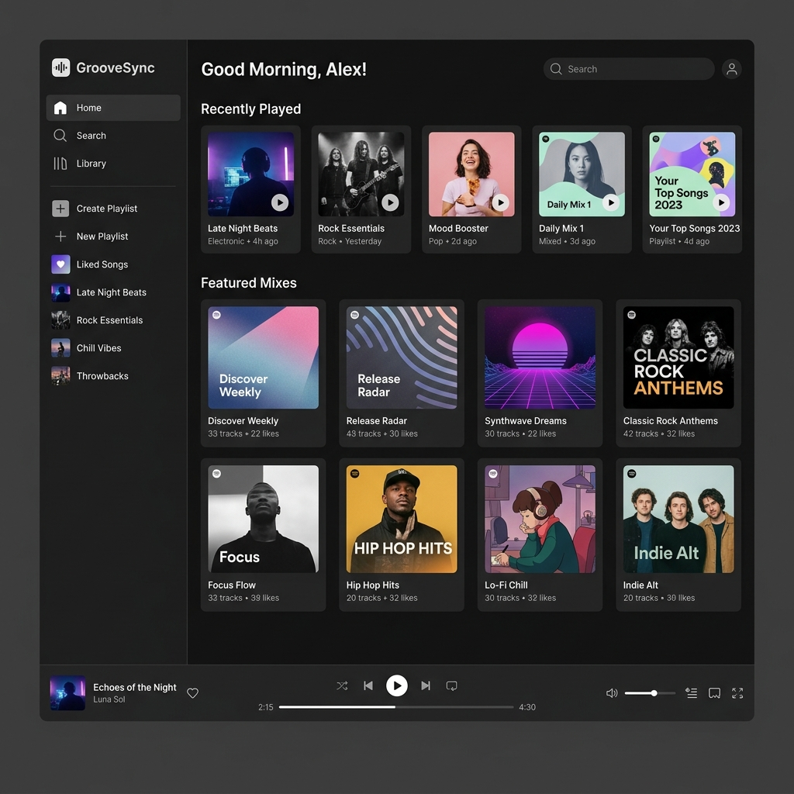

# Task 1: Figma AI Wireframe Generation - Music Playlist Manager

## 1. Prompt Provided to Figma AI
> **Text Prompt:**
> *"Generate a dark-themed responsive desktop UI wireframe for a 'Music Playlist Manager' app (named GrooveSync). Include a left-side navigation panel (Home, Search, Library, Create Playlist, Liked Songs), a main dashboard displaying 'Recently Played' and 'Featured Mixes' grid cards with play buttons, a top search header with user avatar, and a persistent bottom audio player control bar featuring album artwork, track title, play/pause controls, progress bar, and volume slider."*

---

## 2. Exported Figma AI Wireframe Image

---

## 3. Wireframe Structural Breakdown

1. **Left Sidebar Navigation:**
   * Primary links: `Home`, `Search`, `Library`.
   * Playlist controls: `Create Playlist`, `Liked Songs`.
   * User's saved playlists list (Late Night Beats, Rock Essentials, Chill Vibes, Throwbacks).

2. **Main Dashboard View:**
   * **Header Bar:** Personalized greeting (`Good Morning, Alex!`), global search bar, and profile avatar menu.
   * **Recently Played Section:** Horizontal card carousel showing album art, playlist titles, genre tags, and quick hover play buttons.
   * **Featured Mixes Grid:** 2-row x 4-column responsive grid featuring curated mixes (Discover Weekly, Release Radar, Synthwave Dreams, Classic Rock Anthems, Lo-Fi Chill, Indie Alt).

3. **Persistent Audio Player Bar (Bottom Sticky):**
   * Currently playing track details (Thumbnail image, Song title "Echoes of the Night", Artist "Luna Sol", and Favorite Heart icon).
   * Playback Controls: Shuffle, Previous, Play/Pause toggle, Next, Repeat, and interactive Seek Progress Bar with time indicators (`2:15 / 4:30`).
   * Right Utility Controls: Volume slider, Queue icon, Devices button, and Fullscreen toggle.
