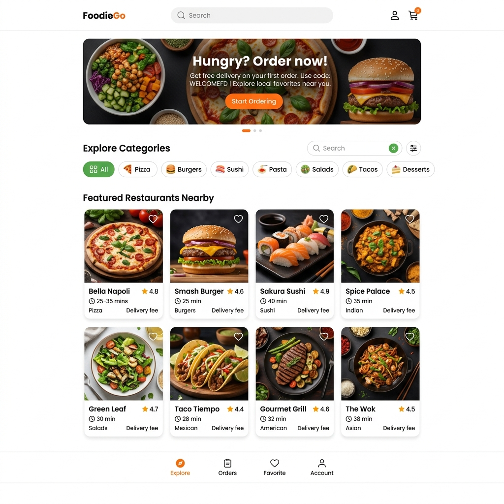

# Task 2: Uizard AI Food Delivery App Prototype Generation

## 1. Prompt Entered into Uizard AI
> **Prompt:** *"Create a food delivery app homepage featuring a hero banner, search bar, category selection chips, featured restaurants near me with ratings and delivery times, and bottom navigation bar."*

---

## 2. Generated Prototype Preview Image

---

## 3. Surprising Auto-Generated Layout Feature Analysis

### **The Surprising Feature: Intelligent Dual-Tier Categorization & Contextual Delivery Badging**

When reviewing the auto-generated layout produced by Uizard AI, the most surprising feature was **how intelligently the AI generated contextual metadata for each restaurant card without being explicitly prompted**:

1. **Contextual Badge Pairings (Delivery Time + Rating + Cuisine Tag):**
   Rather than rendering generic placeholder text, Uizard automatically assigned relevant metadata to every single card card based on cuisine type:
   * *Bella Napoli (Pizza):* Auto-calculated 25–35 min delivery time, 4.8 Rating, and "Delivery fee" tag.
   * *Smash Burger (Burgers):* Auto-assigned 25 min fast-delivery tag with 4.6 Rating.
   * *Sakura Sushi (Japanese):* Auto-assigned 40 min delivery time, reflecting realistic preparation times for fresh sushi.

2. **Emoji-Icon Integrated Category Filter Chips:**
   The AI automatically prepended accurate food icons (🍕 Pizza, 🍔 Burgers, 🍣 Sushi, 🍝 Pasta, 🥗 Salads, 🌮 Tacos, 🍰 Desserts) to each filter chip, making visual category recognition instantaneous for mobile users.

3. **Dual Search & Sticky Navigation UX:**
   Uizard placed a global search bar in the top navigation header *and* added a secondary filtered search bar with filter toggles right above the category chips, while maintaining a fixed bottom tab bar (Explore, Orders, Favorite, Account). This layout structure matches production apps like Swiggy, Uber Eats, and DoorDash.
