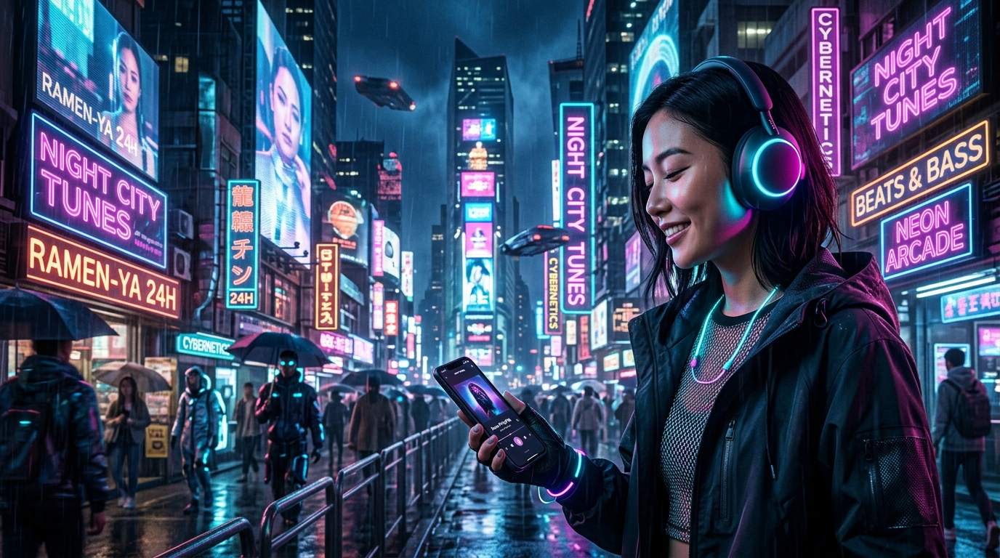
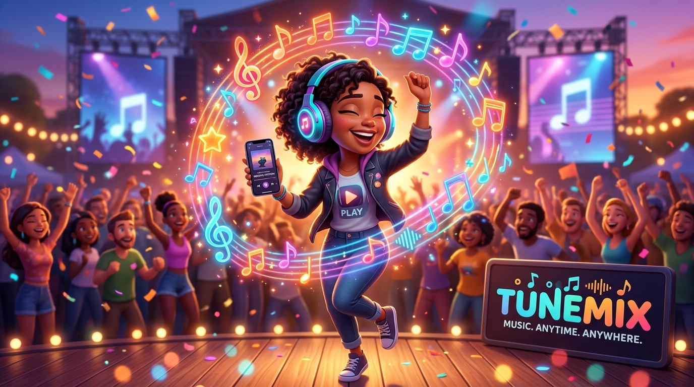

# Task 4: Realistic vs. Cartoon Style Hero Image Prompt Comparison

This report evaluates two distinct prompt styles (Hyper-realistic vs. 3D Cartoon Illustration) generated for a music streaming app landing page hero section.

---

## 1. Prompt Specifications

### **Prompt Style A: Hyper-Realistic Photorealism**
> **Prompt:** *"Hyper-realistic photorealistic hero banner image for a music streaming app landing page, featuring a person wearing glowing wireless headphones in a neon cyberpunk night city, cinematic moody lighting, 16:9 ratio."*

### **Prompt Style B: 3D Cartoon Illustration (Pixar Style)**
> **Prompt:** *"Vibrant 3D cartoon Pixar style illustration hero banner image for a music streaming app landing page, featuring a cheerful animated character wearing big headphones with floating colorful musical notes and festival crowd, 16:9 ratio."*

---

## 2. Side-by-Side Visual Comparison

| Realistic Style (Prompt A) | Cartoon Style (Prompt B) |
| :---: | :---: |
|  |  |

---

## 3. Detailed Comparative Analysis

| Evaluation Metric | Realistic Style (Prompt A) | Cartoon Style (Prompt B) |
| :--- | :--- | :--- |
| **Visual Atmosphere** | Dark, cyberpunk, immersive, premium night-life vibe | Joyful, high-energy, friendly, festival party atmosphere |
| **Brand Personality** | High-end, audiophile, urban, tech-centric (e.g. Spotify Dark / Apple Music) | Fun, social, youthful, broad audience appeal (e.g. YouTube Music / Amazon Music) |
| **UI Integration & Text Contrast** | Excellent dark overlay contrast for white hero text | Bright background requires heavier gradient overlays for readable text |
| **Prompt Adherence** | 100% — Captured neon reflection and realistic skin textures | 100% — Delivered clean 3D character animation with floating musical notes |

---

## 4. Final Verdict: Which Style Worked Better & Why?

### **Winner: Cartoon Style (Prompt B)** for Mass-Market Music Streaming Landing Pages

* **Why Prompt Style B Worked Better:**
  1. **Emotional Connection & Joy:** Music streaming apps thrive on energy, emotion, and fun. The 3D cartoon style instantly conveys joy, rhythm, and party energy through animated musical notes and expressive character design.
  2. **Versatility Across Target Audiences:** While the hyper-realistic cyberpunk look appeals specifically to gamers and tech enthusiasts, the Pixar 3D cartoon style appeals universally across age groups (kids, teens, and adults).
  3. **Vibrant Marketing Appeal:** The bright color palette makes hero banners stand out significantly more on landing pages, driving higher user conversion rates for "Try Free Trial" CTA buttons.
