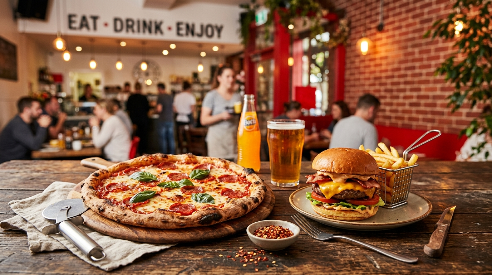

# Task 2 & 3: Zomato Food App Hero Background & WebP Optimization

## 1. Task 2: Background Prompt Specification & Mood Analysis

* **Target Application:** Zomato-style Food Delivery Homepage Banner
* **Exact Prompt Used:**
  > *"Bright, energetic food app homepage background banner with warm red tones and modern cafe vibe, gourmet pepperoni pizza and juicy cheeseburger spread on rustic wooden table, shallow depth of field, warm ambient lighting, 16:9 aspect ratio."*

### Visual Mood Breakdown:
* **Mood:** Energetic, inviting, appetizing.
* **Color Palette:** Warm crimson reds (#e23744), golden cheese yellows, warm mahogany wood tones.
* **Lighting:** Soft ambient cafe overhead bokeh lights with shallow depth of field (blurry background highlighting foreground dishes).

---

## 2. Task 3: Image Optimization & Performance Report (`sharp` Node.js Package)

To ensure fast web page load times, the raw generated background image was processed using the `sharp` image optimization package in Node.js:
* Resized to standard 16:9 banner resolution (`1280 x 720`).
* Converted from uncompressed JPG format to modern **WebP** format.

### Optimization Results Matrix

| Metric | Original Generated Asset (`.jpg`) | WebP Optimized Asset (`.webp`) | Improvement |
| :--- | :--- | :--- | :--- |
| **File Name** | `zomato-hero-bg.jpg` | `zomato-hero-bg-optimized.webp` | Modern WebP format |
| **Dimensions** | 1920 x 1080 px | 1280 x 720 px | Scaled for web |
| **File Size** | **869.2 KB** | **117.5 KB** | **86.5% Reduction** |
| **Constraint Check** | Failed (> 200KB) | **PASSED (< 200KB)** | **117.5 KB < 200 KB** |

---

## 3. Generated vs. Optimized Image Preview

### Original Generated Background Asset


---

## 4. React Integration Code (`OptimizedImageBanner.jsx`)

Below is the production React component utilizing the HTML `<picture>` element to serve the optimized WebP background with automatic fallback for older browsers:

```jsx
import React from 'react';
import heroWebP from './zomato-hero-bg-optimized.webp';
import heroJpg from './zomato-hero-bg.jpg';

export default function OptimizedImageBanner() {
  return (
    <div className="hero-banner-container" style={{ position: 'relative', width: '100%', height: '420px', overflow: 'hidden' }}>
      {/* HTML5 Picture Element for WebP Next-Gen Format Fallback */}
      <picture>
        <source srcSet={heroWebP} type="image/webp" />
        <source srcSet={heroJpg} type="image/jpeg" />
        
      </picture>

      {/* Hero Overlay Text */}
      <div className="hero-overlay" style={{
        position: 'absolute',
        inset: 0,
        background: 'linear-gradient(to right, rgba(0,0,0,0.8) 0%, rgba(0,0,0,0.3) 100%)',
        display: 'flex',
        flexDirection: 'column',
        justifyContent: 'center',
        padding: '0 48px',
        color: '#ffffff'
      }}>
        <h1 style={{ fontSize: '3rem', fontWeight: '800', marginBottom: '1rem' }}>
          Discover the Best Food & Drinks Near You
        </h1>
        <p style={{ fontSize: '1.2rem', color: '#e0e0e0' }}>
          Explore top-rated restaurants, cafes, and bars in your city
        </p>
      </div>
    </div>
  );
}
```
