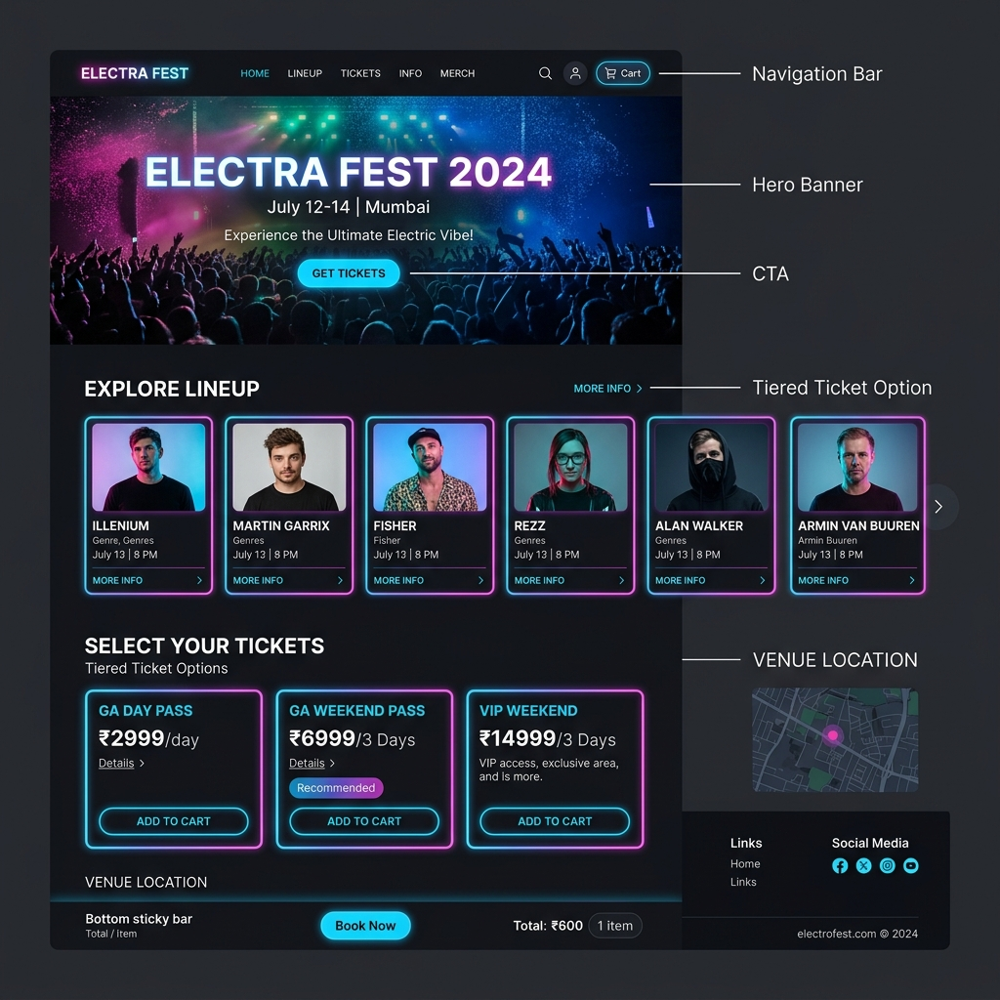

# Task 1: Festival Landing Page Wireframe Report

This document details the Uizard / Figma AI generated wireframe layout for the **ELECTRA FEST 2026** music festival ticketing site (combining BookMyShow ticketing flow + IPL electric sports vibe).

---

## 1. Prompt Used to Generate Wireframe
> **Prompt:** *"Create a responsive dark-mode landing page wireframe for a music festival ticketing website named ELECTRA FEST. Include top navbar with cart icon, hero banner with headline and CTA, horizontal artist lineup cards, tiered ticket options (Day Pass, VIP Weekend Pass), venue map location, and sticky bottom checkout bar."*

---

## 2. Exported Wireframe Asset (`festival-landing-wireframe.png`)

---

## 3. Key Layout Components Breakdown

1. **Header Navigation Bar:** Brand logo (`ELECTRA FEST`), navigation links (`Lineup`, `Tickets`, `Info`, `Merch`), search icon, user profile, and Cart counter badge.
2. **Hero Banner Section:** Full-bleed dark nightlife festival background image (`hero-image.png`), bold headline, location badge (`July 12-14 | Mumbai`), and prominent `"GET TICKETS"` call-to-action button.
3. **Explore Lineup Carousel:** Glowing neon artist cards featuring headliners (Martin Garrix, Illenium, Fisher, Rezz, Alan Walker, Armin van Buuren) with performance dates and stage times.
4. **Select Your Tickets (Tiered Options):**
   * *GA Day Pass:* ₹2,999 / day
   * *GA Weekend Pass (Recommended):* ₹6,999 / 3 days
   * *VIP Weekend Pass:* ₹14,999 / 3 days (VIP Lounge, Express Entry, Merch kit)
5. **Interactive Sticky Bottom Bar:** Persistent checkout summary displaying selected tickets count and instant `"Book Now"` button.
