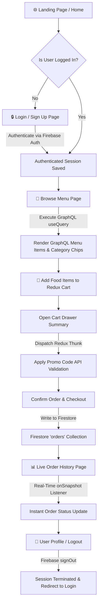

# Capstone Session 1: User Journey Flow Diagram

---

## 1. Complete User Journey Flowchart (Mermaid Visual Diagram)

---

## 2. 4-Step Interactive User Journey Breakdown

1. **Step 1: Landing & Authentication (Firebase Auth):**
   * The user arrives at the Landing Page (`/`). If trying to access protected history, they are directed to `/login` to sign up or log in via Firebase Email/Password Authentication. Session state is preserved globally via `onAuthStateChanged()`.

2. **Step 2: Menu Discovery & GraphQL Query (`/menu`):**
   * The user navigates to the Menu page. Apollo Client executes a `useQuery` GraphQL query to fetch food items dynamically without over-fetching. Users click category chips to filter food items.

3. **Step 3: Redux Cart Management & Async Promo Thunk:**
   * Adding dishes dispatches Redux `addItem` actions. In the Cart Drawer, entering a promo code triggers `applyDiscountThunk` for async server validation before recalculating subtotal and discount percentage.

4. **Step 4: Real-time Order Submission & Live Tracking (`/orders`):**
   * Submitting checkout writes an order document to the Firestore `orders` collection. The Order History page listens via `onSnapshot()`, displaying the new order instantly without page refresh. User can log out safely when done.
