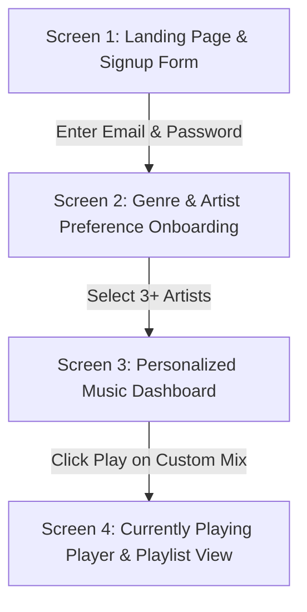

# Capstone Session 2 — Task 3: User Journey Mappings

This document maps out the step-by-step user journeys and screen transitions for two major digital product flows: **Booking a Movie Ticket (BookMyShow Flow)** and **New User Onboarding (Spotify Music Dashboard Flow)**.

---

## 1. User Journey 1: Booking a Movie Ticket (BookMyShow Flow)

```mermaid
flowchart LR
    A[Screen 1: App Homepage] -->|Select City & Movie| B[Screen 2: Movie Details & Trailer]
    B -->|Click 'Book Tickets'| C[Screen 3: Theater & Showtime Selection]
    C -->|Select Time Slot| D[Screen 4: Interactive Seat Layout Grid]
    D -->|Choose Seats & Food Addons| E[Screen 5: Booking Summary & Payment]
    E -->|Complete UPI / Card Payment| F[Screen 6: Booking Confirmation & QR Ticket]
```

### **Detailed Step-by-Step Screen Transitions:**

1. **Screen 1: Homepage & Location Selection**
   * *User Action:* User opens app, selects current city (e.g. Mumbai), and browses trending movie banners.
2. **Screen 2: Movie Details & Synopsis**
   * *User Action:* Clicks on movie poster ("Kalki 2898 AD"), views rating (8.8/10), trailer, and clicks **"Book Tickets"**.
3. **Screen 3: Cinema & Showtime Picker**
   * *User Action:* Selects date, filter formats (IMAX 3D / 2D), and picks a showtime (e.g., PVR Phoenix • 7:15 PM).
4. **Screen 4: Interactive Seat Selection Grid**
   * *User Action:* Views color-coded seat layout (Available, Recliner, Sold out), selects 2 seats (Row F8, F9), and accepts seat pricing.
5. **Screen 5: Payment & F&B Checkout**
   * *User Action:* Reviews total price, adds popcorn/beverage addon, enters promo code, and pays via UPI (Google Pay/PhonePe).
6. **Screen 6: Order Confirmation & Digital M-Ticket**
   * *User Action:* Receives instant booking confirmation with downloadable QR code ticket, SMS confirmation, and add to calendar button.

---

## 2. User Journey 2: New User Signup & Music Discovery (Spotify Flow)

### **Screen Flow & Transition Purpose Analysis:**

| Step | Screen Name | Screen Purpose & Key Interactions | Transition Trigger |
| :--- | :--- | :--- | :--- |
| **Step 1** | **Landing / Signup Screen** | Collects user email/password or Google Single Sign-On (SSO). Establishes user profile identity. | Clicks "Create Account" |
| **Step 2** | **Music Preference Onboarding** | Prompts user to pick 3+ favorite artists/genres (e.g., Pop, EDM, Rock) to train the recommendation algorithm. | Clicks "Continue to App" |
| **Step 3** | **Personalized Home Dashboard** | Renders custom "Daily Mix" cards, recommended playlists, and trending top charts tailored to onboarding picks. | Clicks any Playlist Card |
| **Step 4** | **Playlist & Audio Player Screen** | Plays selected playlist, displays track queue, album artwork, lyrics toggle, and bottom persistent playback bar. | Music starts streaming |
